## R1
For most scuba shop in Thailand, dive trips are often posted on social media and requires clients to call dive shops to personally book a trip. As there is an increasing amount of interest in scuba diving in Thailand, demands for dive trips are simultaeneously increasing. Therefore the goal of this app is to help dive shops tackle with demand by allowing user to book trip online and search for different dive trips.

## R2
Although, the current system works, with the increase in demand the current ways of operating may face inefficiency. By utilising a database it will not only make it easier for users to discover new dive trips and book them remotely, it will also streamline bookings for dive shops admin. Using the database, admins can always keep track of numbers of users, bookings, and dive trips currently active. Moreover, admin can query the database and quickly sought out necessary information. Additionally, as this platform is likely to increase user experience, the dive shop business will likely expand as customer values sufficiency.

## R3
I have chosen to use PostgreSQL due to the advantages it provide. First, psql is an open source DBMS that provides enterprise-class performance and functionalities. Second, psql supports multiple languages which is very beneficial. Third, psql has a very diverse community. This is highly beneficial as it leads to and contributes significantly to the development of various modules. As developers are often communicating with each other and sharing ideas.

## R4
Object relational mapping (ORM) is a tool used to map relational database to objects using object oriented progamming (OOP) languages. It provides object-oriencted layer between relational databases and OOP languages without developers having to write SQL queries.

There are many benefits to using an ORM. First, due to its functionalities ORM can immensely speed up development time. Additionally, this also leads to decreases cost in development. Second, the ORM handles all logic required to interact with database. Thirds, due to the structure and functionalities of ORM tools which are built to eliminate SQL injection attacks, ORM increases security for developers. Lastly, unlike with SQL, ORM enables developer to write less code.

## R5
### User routes:
#### /users
Methods: GET\
Arguments: None\
Description: Return all users\
Response Body:
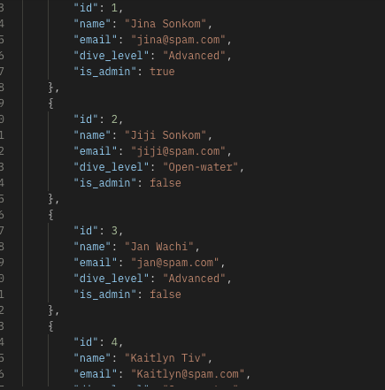

#### users/id
Methods: GET\
Arguments: None\
Description: Get one user by id number\
Response Body:
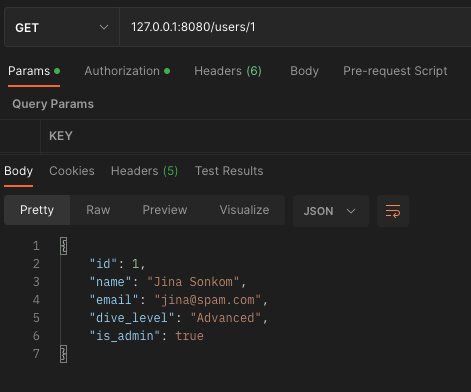

#### users/dive_level
Methods: GET\
Arguments: None\
Description: Get one user by dive_level\
Response Body:
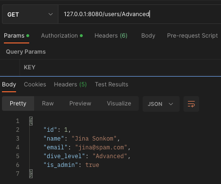

#### users/id
Methods: DELETE\
Arguments: user_id\
Description: Delete one user by id number\
Authentication: @jwt_required(), Bearer token\
Response Body:
.png)

#### users/id
Methods: PUT , PATCH\
Arguments: dive_level\
Description: Delete one user by id number\
Authentication: @jwt_required(), Bearer token\
Response Body:
.png)

### dive_trips routes:
#### /dive_trips
Methods: GET\
Arguments: None\
Description: Return all dive trips\
Response Body:
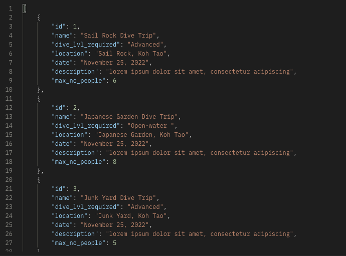

#### dive_trips/id
Methods: GET\
Arguments: None\
Description: Get one dive trip by id number\
Response Body:
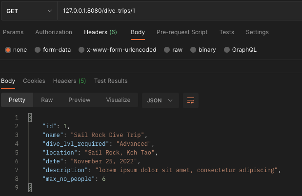

#### dive_trips/dive_level
Methods: GET\
Arguments: None\
Description: Get dive trip by dive_level\
Response Body:
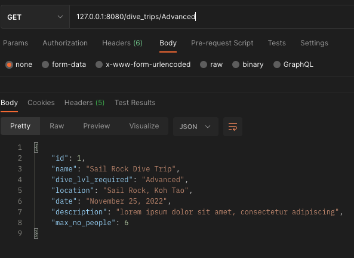

#### dive_trips/id
Methods: DELETE\
Arguments: dive_trips_id\
Description: Delete one dive trip by id number\
Authentication: @jwt_required(), Bearer token\
Response Body:
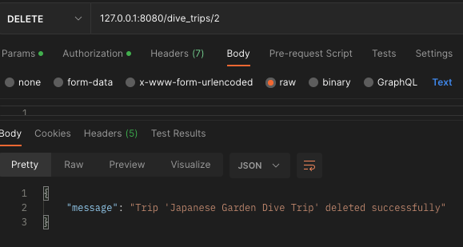

#### dive_trips/id
Methods: PUT , PATCH\
Arguments: dive_lvl_required\
Description: Delete one user by id number\
Authentication: @jwt_required(), Bearer token\
Response Body:
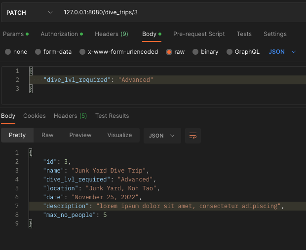

#### /dive_trips
Methods: POST\
Arguments: all dive_trip attributes\
Description: create dive_trip instance\
Authentication: @jwt_required(), Bearer token\
Response Body:
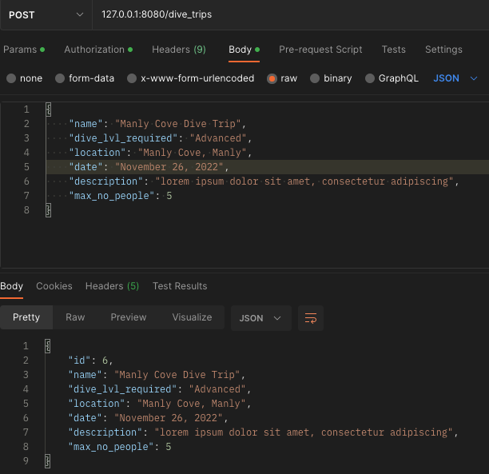

### auth routes:
#### auth/register
Methods: POST\
Arguments: name, email, password, dive_level\
Description: register and create user\
Response Body:
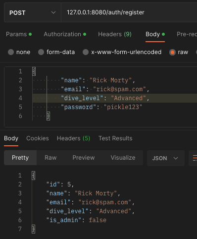

#### auth/login
Methods: POST\
Arguments: email, password\
Description: create access token\
Response Body:
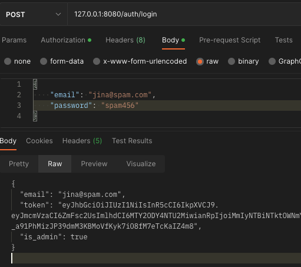

### Booking routes:
#### /bookings
Methods: GET\
Arguments: None\
Description: Return all bookings\
Response Body:
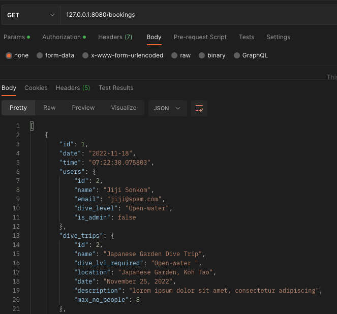

#### bookings/id
Methods: GET\
Arguments: None\
Description: Get one booking by id number\
Response Body:
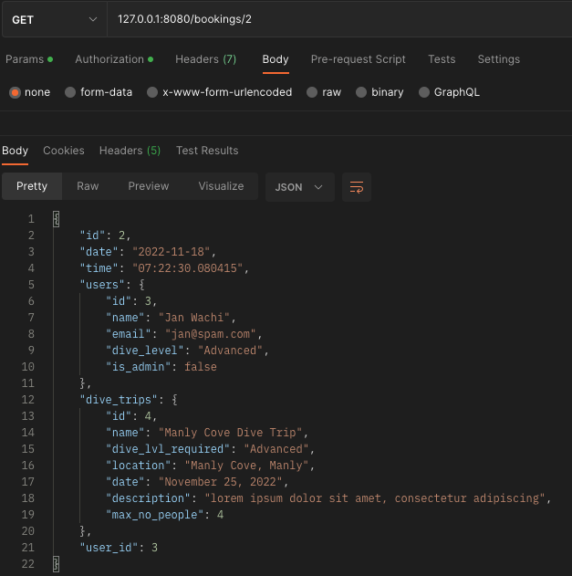

#### /bookings
Methods: DELETE\
Arguments: None\
Description: Delete a booking by ID\
Response Body:
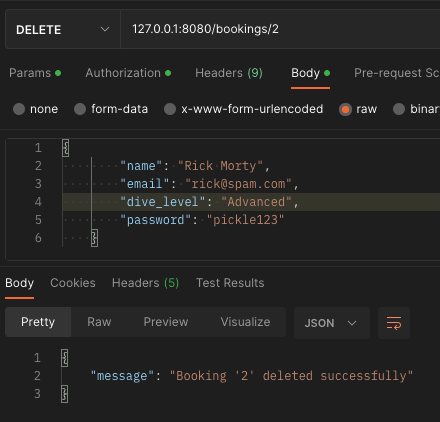

## R6
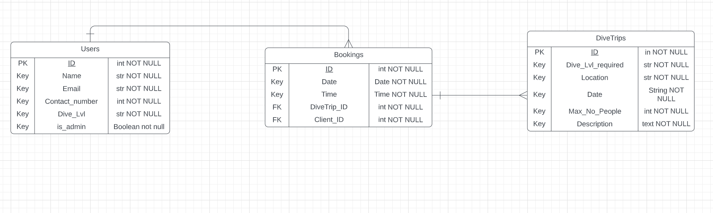

## R7
-Flask
-Flask_Bcrypt
-flask_jwt_extended
-flask_marshmallow
-Flask-SQLAlchemy
-pip-review
-psycopg2
-python-dotenv
SQLAlchemy

## R8
### User Cardinality
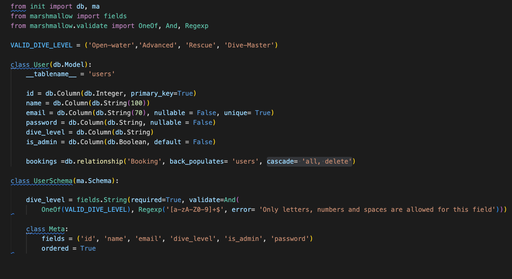

### Booking Cardinality
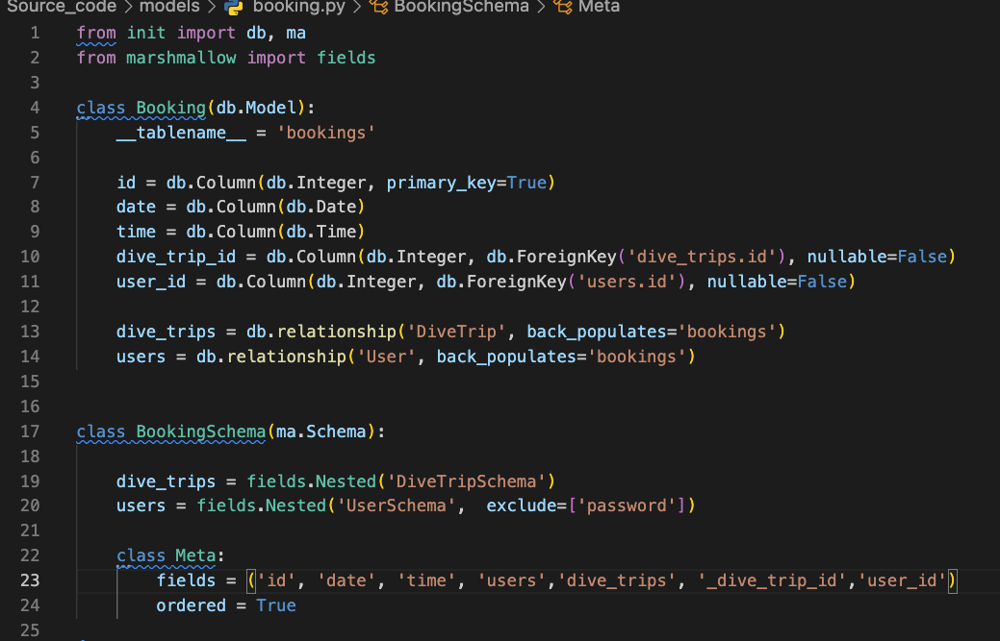

### Dive Trip Cardinality
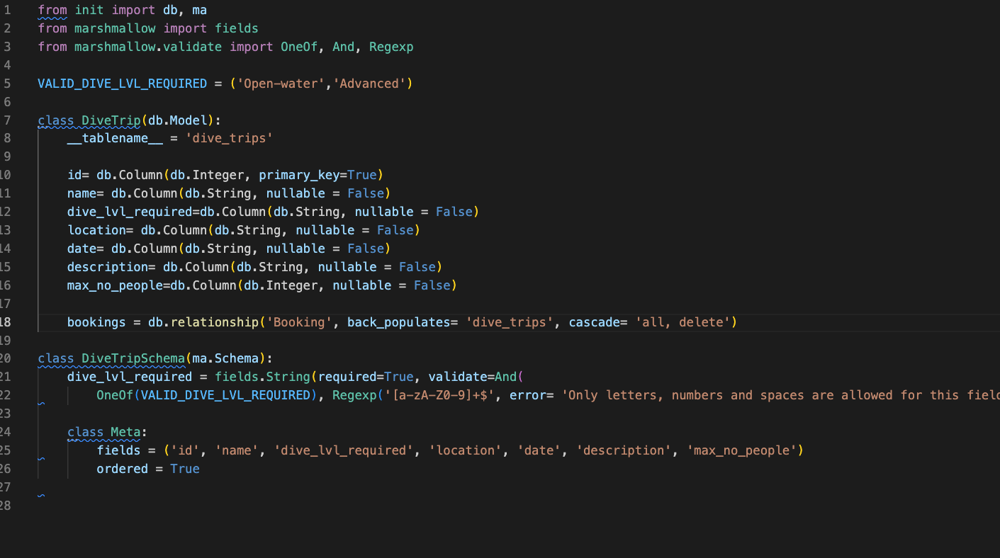

## R9
### User Model
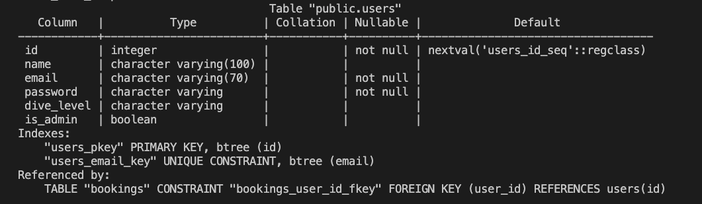

### Booking Model
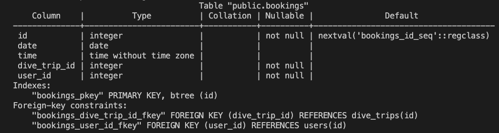

### Dive Trip Model
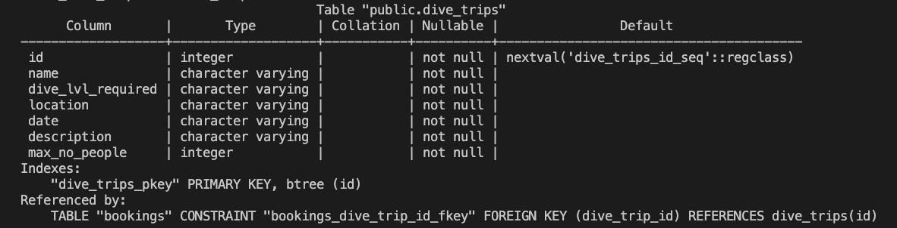

## R10
https://trello.com/b/0rNLEBOU/kanban-template

